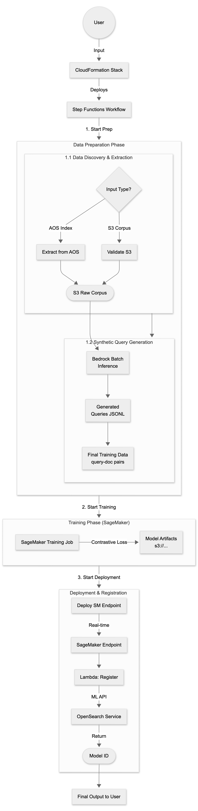

# Scope Doc: Automated Fine-Tuning for OpenSearch Retrieval Models

## 1. Overview

The goal of this project is to provide an automated solution for OpenSearch users to fine-tune Text Retrieval Models. This solution utilizes AWS Bedrock to generate synthetic query data (Synthetic Queries), and SageMaker for model fine-tuning and deployment, with automatic registration to OpenSearch Service.

**Supported Model Types:**

*   **Dense Models:** public-available models including BGE, GTE.
*   **Neural Sparse Models:** OpenSearch's sparse models.

## 2. High-Level Architecture

The core workflow is orchestrated by AWS Step Functions to ensure state management and error handling for long-running tasks (such as data generation and training).

### 2.1 Workflow Diagram

*(See `workflow.md` for diagram source)*

## 3. Detailed Scope & Tasks

We divide the project into Phase 1 (POC) and Phase 2 (Production/Productization), breaking down tasks into Engineering and Science dimensions.

### 3.1 Phase 1: POC

**Goal:** Establish an End-to-End workflow, proving that "synthetic data + fine-tuning" can produce viable models and successfully register them to OpenSearch.

**User Experience:**
*   After deploying the CFN stack and providing necessary parameters, the user simply waits for the process to complete. The final Model ID will be available in the OpenSearch cluster without any manual intervention.

**Key Assumptions for POC:**

*   Users directly provide a cleaned Corpus (txt/jsonl) on S3, or a simple AOS Index Dump.
*   Support 1-2 specific dense models (e.g., BGE-base-en-v1.5) and OpenSearch sparse models.
*   **Data Sampling:** Use a subset of the corpus (e.g., N=5000) for POC to speed up iterations, rather than using the full dataset.
*   Use only Positive Pairs (Query, Doc) for training; Hard Negatives will not be handled initially.
*   Use SageMaker Real-time inference (provisioned) to simplify deployment.

### 3.2 Phase 2: Productization (Production Ready)

**Goal:** Improve model robustness, training performance, cost optimization, and user experience.

**Key Features for Prod:**

*   **Hard Negative Mining (P1):** Introduce a process to mine hard negatives, significantly improving retrieval performance.
*   **Knowledge Distillation (P1):** Use a Cross-Encoder (Reranker) as a Teacher to score the Bi-Encoder.
*   **Smart Defaults:** Default parameters determined based on extensive Benchmarks.
*   **Cost Estimation:** Estimate costs for users before training.
*   **Serverless Deployment:** Support Serverless Inference to reduce idle costs. Benchmark between serverless and real-time inference to give recommendations.

## 4. Action Items & Effort Estimation

**Effort Scale:**
*   **S (Small):** 1-3 Days
*   **M (Medium):** 1-2 Weeks
*   **L (Large):** 2-4 Weeks

### Phase 1: POC Stage

| Domain | Action Item | Description | Priority | Effort |
| :--- | :--- | :--- | :--- | :--- |
| Eng | Infrastructure Skeleton (CFN + Step Functions) | Build basic CFN framework, including Step Functions state machine definition, IAM Role permission configuration (S3, SM, Bedrock, AOS). | P0 | M |
| Eng | Data Gen: Bedrock Batch Integration | Implement logic to call Bedrock Batch Inference (Nova/Claude). Includes Input JSONL construction, Batch Job submission and polling. | P0 | S |
| Eng | Deployment & Registration Logic | Write Lambda code: 1. Create SM Endpoint; 2. Call OpenSearch API to register Connector and Model Group. | P0 | S |
| Eng | AOS Index Data Extractor | Develop efficient OpenSearch Data Dumper (e.g., using PIT/Scroll or Snapshot restore) to handle large-scale Index export to S3. | P0 | M |
| Sci | Prompt Engineering for Query Gen | Design Prompts suitable for general domains, allowing LLM to generate high-quality Queries (Factoid + Concept query) based on documents. | P0 | S |
| Sci | Default Hyper-parameters (MVP) | For the Base Model selected for POC, determine a set of conservative LR, Batch Size, minimum data size, Epochs to ensure Loss convergence and prevent divergence. | P0 | S |
| Sci | Training Script | Write training script based on `sentence-transformers`. Should be compatible with SageMaker infra/APIs. Should support both sparse and dense models via sentence-transformers API. | P0 | M |

### Phase 2: Productization Stage

| Domain | Action Item | Description | Priority | Effort |
| :--- | :--- | :--- | :--- | :--- |
| Eng | Inference Option: Serverless | Add support for SageMaker Serverless Inference. Need to handle Cold Start and Concurrency configuration. | P0 | M |
| Sci | Benchmark: Optimal Defaults | Conduct extensive testing on public datasets like BEIR. Output a Lookup Table: Recommend optimal Epoch and Learning Rate based on data size. | P0 | L |
| Sci | Resource & Cost Estimation | Establish formula: `Cost = f(Data_Size, Model_Type)`. Need to consider Bedrock Token fees + GPU training duration. | P0 | M |
| Sci | Advanced Training: Hard Negatives | Design Pipeline: Mine Hard Negatives before or during training using the current model. Evaluate its impact on training duration and final results. | P1 | L |
| Sci | Advanced Training: KD (Distillation) | Introduce Cross-Encoder (e.g., BGE-Reranker) to score Pairs, replacing simple Contrastive Loss with KL-Divergence Loss. | P1 | L |
| Eng | Infrastructure Finalize | Add error handling, retries, and other mechanisms to improve robustness for production use. | P0 | M |